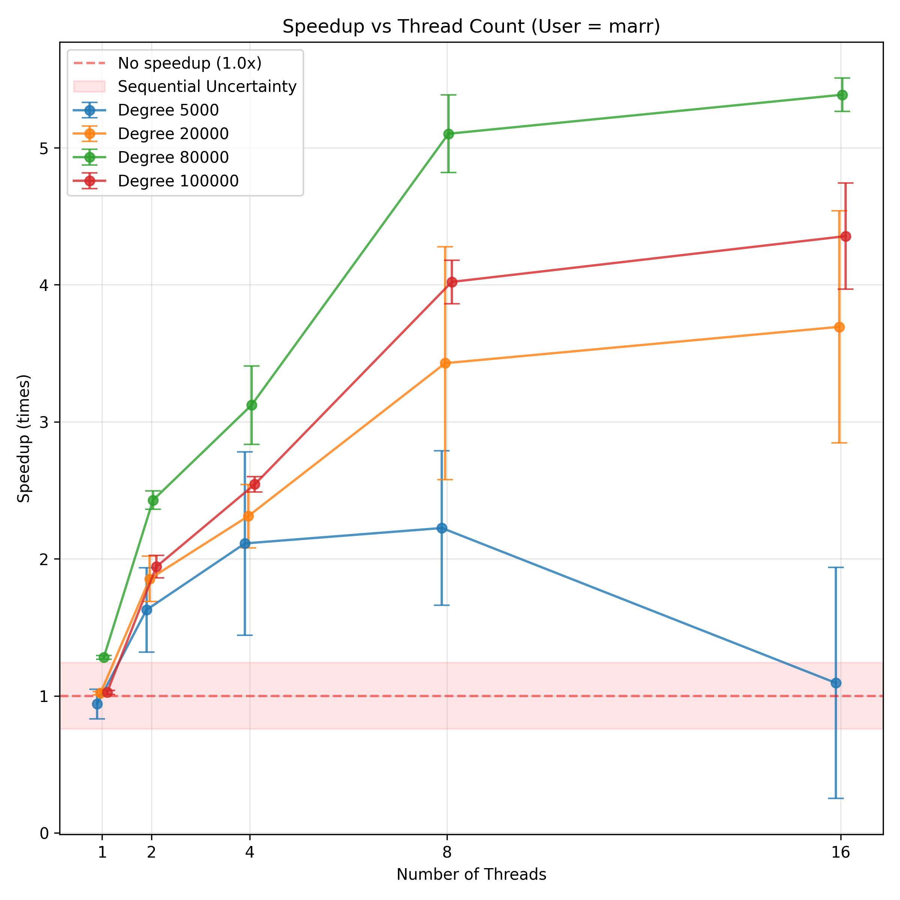
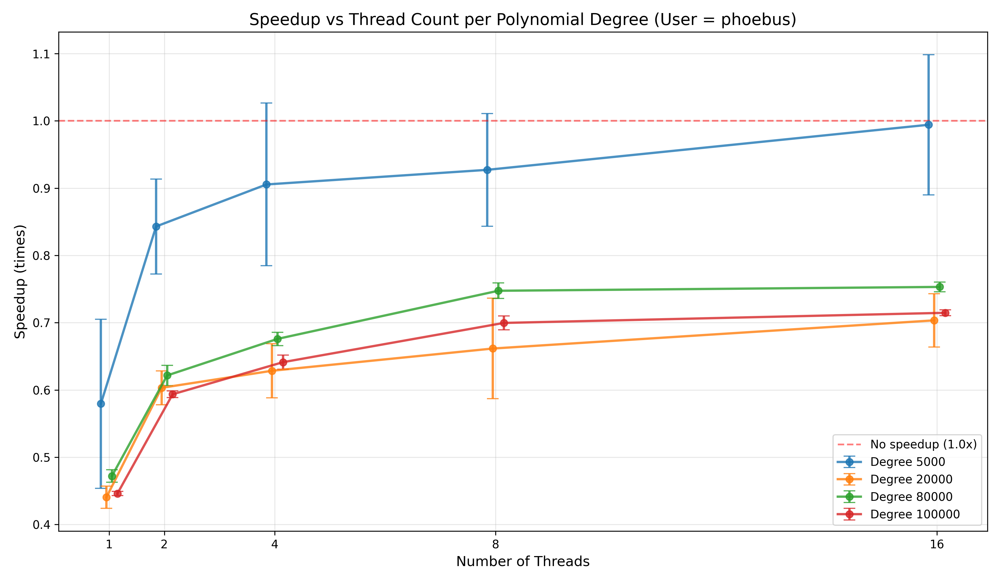
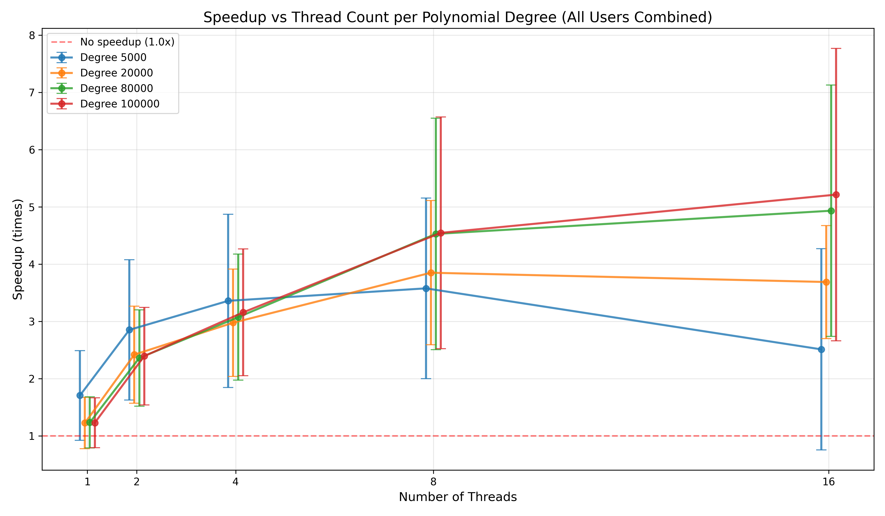

**Exercise 1.1 — Polynomial Multiplication**

Overview:
Implement multiplication of two degree-n polynomials using a sequential algorithm and a Pthreads parallel algorithm; verify correctness and measure timings for allocation, initialization, sequential baseline, thread creation, parallel compute, join, cleanup and total time.

Expected Outcome:
- For small degrees the sequential version will usually be faster due to thread overhead; for sufficiently large n the parallel version can outperform the sequential one, but speedup depends on load balance and memory locality.

Answer to Handout questions:
- Q: Do you observe speedup? A: Only for larger polynomial degrees and well-balanced thread counts; small n shows overhead-dominated slowdowns.
- Q: Did you need synchronization? A: No locks are required if each thread writes to disjoint `C[k]` indices; partitioning must ensure no overlapping writes.
- Q: What causes variability in timings? A: Thread creation/join overhead, load imbalance (different work per `k`), cache effects and OS scheduling noise.

Results Analysis:
The measurements show that speedup emerges at degree 80,000 and improves further at degree 100,000. With degree 20,000, thread overhead dominates and prevents speedup. Thread creation costs are significant (17ms for 16 threads), but this overhead is amortized as polynomial degree increases. The speedup plateaus around 8 threads; additional threads create contention without benefit due to CPU core limitations and unbalanced workload distribution across threads. Sequential time grows cubically with degree (O(n^2) operations).

Plots:
-  - Speedup by polynomial degree for marr user. Shows speedup threshold around degree 20,000; larger degrees show 2-3x speedup with 4-8 threads.
-  - Speedup by polynomial degree for phoebus user. Similar pattern with speedup emerging at higher degrees; thread overhead visible at 16 threads.
-  - Combined speedup across all users. Confirms the trend: low degrees show no speedup, large degrees show consistent 2-3x improvement at optimal thread counts.
