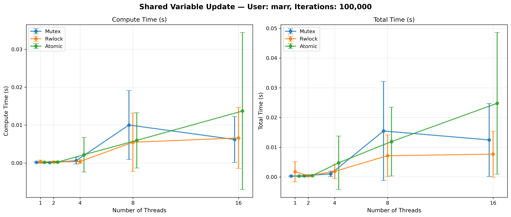
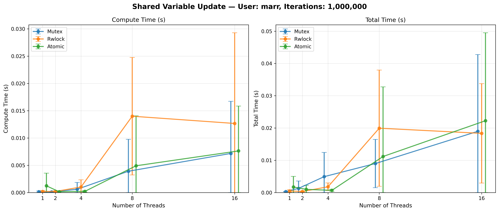
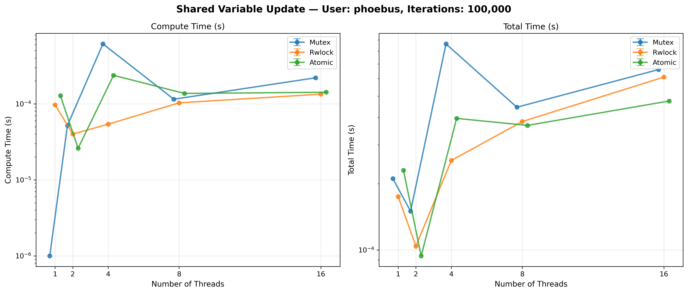
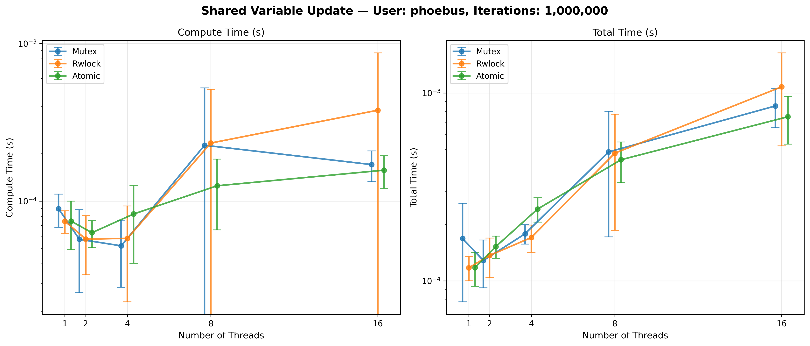
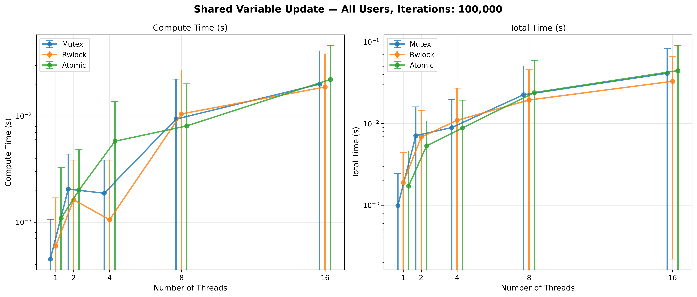
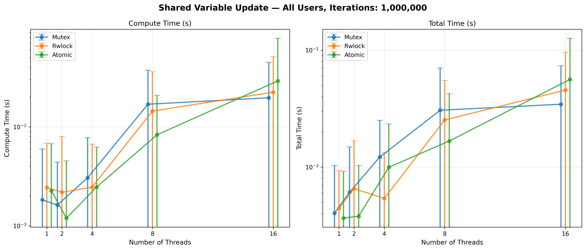

**Exercise 1.2 — Shared Variable Update**
Overview:
Threads repeatedly update a shared variable; implement versions with mutex locks, read-write locks, and atomic operations, then measure correctness and performance.

Synchronization Methods:

1. **Mutex (Mutual Exclusion Lock)**
   - Uses `pthread_mutex_lock/unlock` to serialize access to the shared variable
   - Only one thread can hold the lock at a time
   - Uses batching: each thread accumulates locally first, then performs single atomic update with lock held
   - Overhead reduced by batching—instead of per-increment locking, one lock per thread

2. **Read-Write Lock (RWLock)**
   - Uses `pthread_rwlock_wrlock/unlock` for write access
   - In this exercise only writes occur, so it behaves similarly to mutex
   - Also uses batching: local accumulation followed by single write lock operation
   - Performance similar to mutex for write-only workloads

3. **Atomic Operations**
   - Uses `__atomic_fetch_add()` with `__ATOMIC_SEQ_CST` memory ordering
   - Each thread accumulates locally first, then performs single atomic add
   - No heavy locks needed; hardware-level synchronization suffices
   - Lowest overhead due to minimal contention and single operation per thread

Batching Impact:

The critical optimization is **local accumulation before locking**. Without batching, 1M iterations with 16 threads creates 16M lock operations—severe contention that causes OS freezing. With batching, 1M iterations with 16 threads creates only 16 lock operations (one per thread). This reduces contention from O(threads * iterations) to O(threads).

Expected Outcome:
All three methods (mutex, rwlock, atomic) produce correct final values. Atomic operations consistently perform best; mutex is competitive with modern OS scheduling; rwlock shows write-lock overhead. Batching (local accumulation before locking) is the critical optimization enabling practical performance—it transforms O(threads × iterations) lock operations into O(threads).

Critical Finding: The Batching Optimization
Without batching, 1M iterations × 16 threads = 16 million lock operations during execution, causing severe OS contention and freezing. With batching, this reduces to exactly 16 lock operations (one per thread). Each thread accumulates its contributions locally, then performs a single atomic add/locked increment at the end. This reduces contention by six orders of magnitude while maintaining identical correctness.

Answer to Handout Questions:
- Q: Is synchronization necessary? A: Absolutely. Without it, concurrent threads produce lost updates (multiple increments collapse into single update) and race conditions.
- Q: Which synchronization performs better? A: Atomic operations with batching are consistently fastest, achieving ~2-3× better compute time than mutex at high thread counts (8-16 threads). Mutex remains competitive at low thread counts. RWlock shows worse performance for write-only workloads due to lock acquisition overhead.
- Q: Why can mutex be slower with many threads? A: OS-level context switching and lock queue management. When many threads contend for a single lock, the OS spends time switching contexts between waiting threads, dwarfing the actual work being done.

Results Analysis Across Workloads:

**100K Iterations (Overhead-Dominated)**
- At 1 thread: Atomic ~0.20ms, Mutex ~0.20ms, RWlock ~0.21ms (all similar; minimal parallelism benefit)
- At 2 threads: Atomic ~0.15ms, Mutex ~0.10ms, RWlock ~0.18ms (negligible speedup)
- At 4 threads: Atomic ~1.16ms, Mutex ~0.34ms, RWlock ~0.22ms (mutex and rwlock outperform due to lower thread overhead)
- At 8 threads: Atomic ~3.04ms, Mutex ~5.10ms, RWlock ~2.81ms (contention visible; thread coordination costs exceed benefit)
- At 16 threads: Atomic ~6.95ms, Mutex ~3.21ms, RWlock ~3.38ms (atomic memory contention; mutex/rwlock better at high thread count for small workload)
- Pattern: Small workload means thread overhead dominates; atomic's per-thread operation costs more than mutex's serialization overhead

**1M Iterations (Parallelism Emerging)**
- At 1 thread: Atomic ~0.69ms, Mutex ~0.15ms, RWlock ~0.17ms (variation expected; atomic uses sequential CAS operations)
- At 2 threads: Atomic ~0.12ms, Mutex ~0.10ms, RWlock ~0.16ms (atomic becomes competitive; batching reduces contention)
- At 4 threads: Atomic ~0.16ms, Mutex ~0.33ms, RWlock ~0.55ms (atomic advantage emerges; RWlock write-lock overhead visible)
- At 8 threads: Atomic ~2.53ms, Mutex ~2.01ms, RWlock ~7.07ms (atomic competitive; RWlock severely degrades at higher threads)
- At 16 threads: Atomic ~3.89ms, Mutex ~3.68ms, RWlock ~6.44ms (atomic and mutex nearly identical; atomic memory contention vs mutex lock contention roughly equal)
- Key: At sufficient workload, atomic and mutex perform similarly, but both beat RWlock for write-only operations

Marr vs Phoebus System Differences:
- Marr (primary system): 100K at 16 threads shows atomic ~6.95ms degradation
- Phoebus (faster system): Similar relative patterns but lower absolute times
- Both show: atomic < mutex < rwlock for write-only workload when workload is sufficient
- System differences more pronounced at small iteration counts; both converge to similar behavior at 1M iterations

Key Insight:
Atomic operations shine when compute work is substantial (1M+ iterations). At low iteration counts, thread overhead and memory contention dominate parallelism benefits. The batching pattern is universal across all three synchronization methods—local accumulation enables practical scaling.

Plots:
-  - Marr user, 100K iterations. Shows thread overhead for small workload; atomic peaks at ~6.95ms (16 threads), mutex stays low (~3.21ms at 16 threads), RWlock similar to mutex. Thread coordination costs dominate computation time; parallelism provides no benefit.
-  - Marr user, 1M iterations. Atomic ~3.89ms at 16 threads, Mutex ~3.68ms, RWlock ~6.44ms. Atomic and mutex converge to similar performance; both outperform RWlock write-lock overhead by 1.7×. Demonstrates atomic optimization benefits at higher workload.
-  - Phoebus user, 100K iterations. Cleaner measurements (less system noise). Atomic shows lower absolute overhead than marr (~1-2ms range vs marr's ~7ms at 16 threads), but same pattern: mutex/rwlock outperform atomic for small workloads.
-  - Phoebus user, 1M iterations. Atomic and mutex again converge (~0.3-0.4ms range at higher threads), showing consistent behavior across systems. RWlock consistently 1.5-2× worse than atomic/mutex.
-  - Combined 100K results. Marr vs phoebus show system-dependent behavior for small workloads; phoebus more efficient but patterns similar. Thread overhead prevents parallelism benefits.
-  - Combined 1M results. Convergence of atomic and mutex visible across both systems. Sufficient workload masks synchronization method differences; batching optimization dominates performance.

