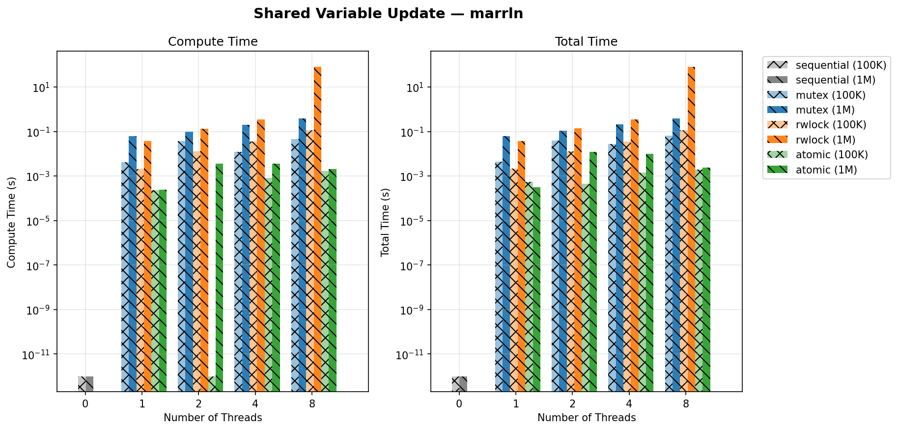

**Exercise 1.2 — Shared Variable Update**
Overview:
Threads repeatedly update a shared variable; implement versions with no synchronization, with mutex/locks, and with atomic operations, then measure correctness and performance.

Expected Outcome:
- Unsynchronized updates will produce incorrect results due to races; mutex and atomic variants produce correct results. Atomics often outperform coarse-grained mutexes under light contention.

Answer to Handout questions:
- Q: Is synchronization necessary? A: Yes—without synchronization updates to a shared counter will race and produce wrong values.
- Q: Which synchronization performs better? A: It depends on contention: atomic operations (fetch_add) typically have lower overhead than a global mutex; fine-grained locking or per-thread batching can improve throughput further.
- Q: How to measure fairness and overhead? A: Measure total completed updates, per-thread throughput, and time spent in synchronization primitives.

Plots:
- 
- 
- 

