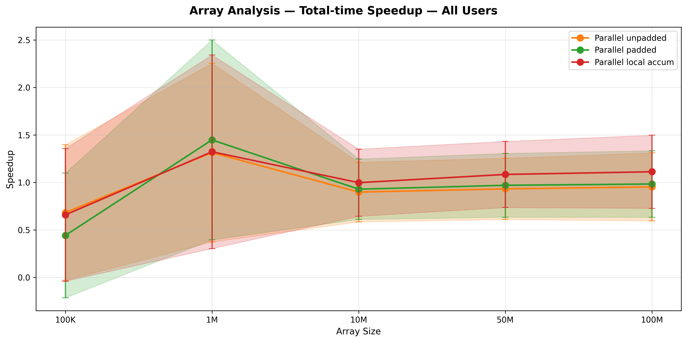
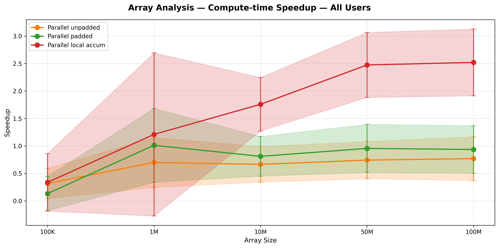
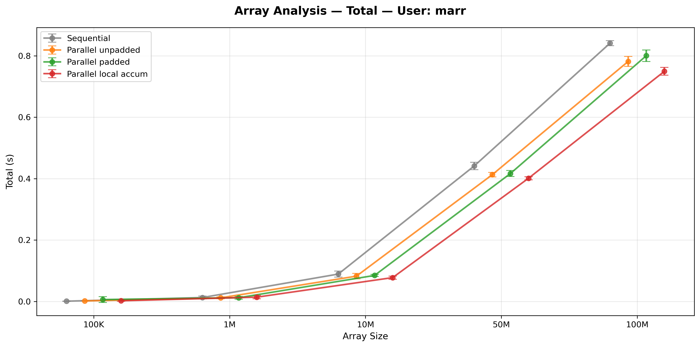
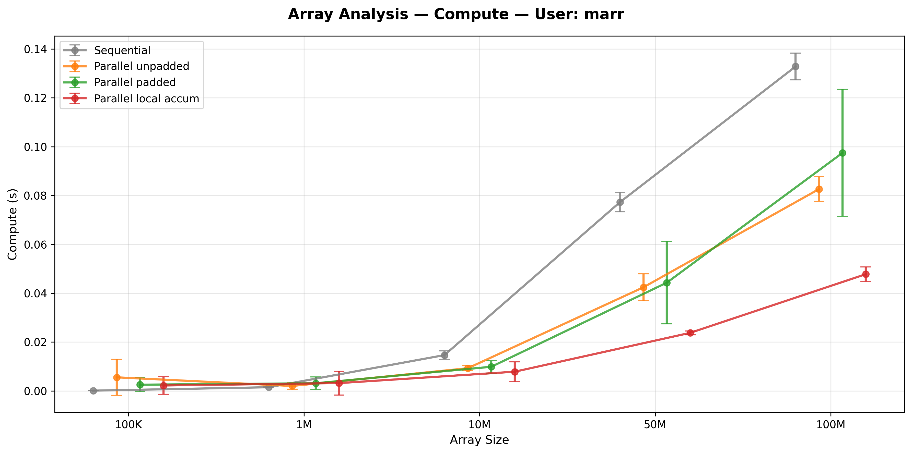
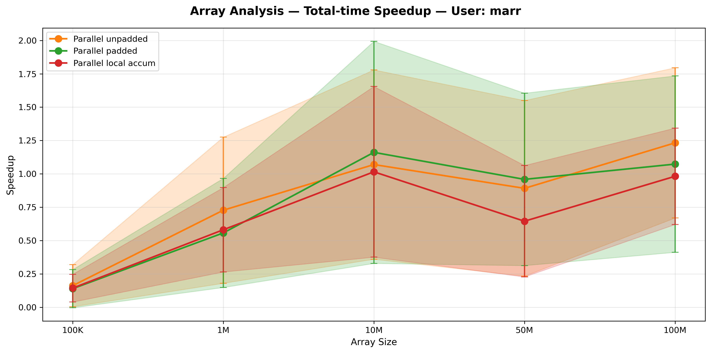
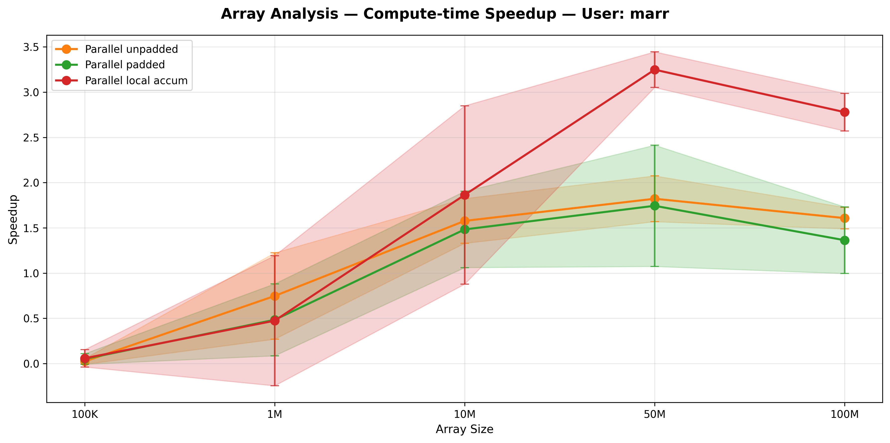
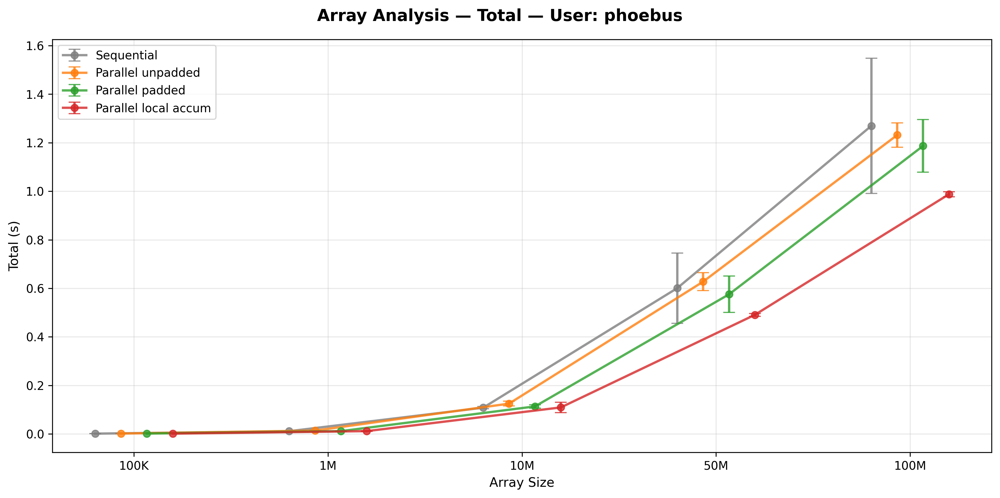
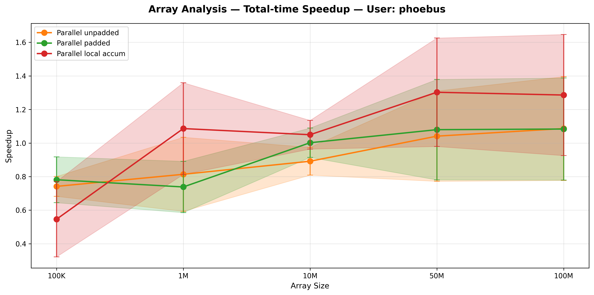

**Exercise 1.3 — Array Analysis**

Overview:
Use threads to analyze large arrays of data by partitioning into disjoint segments and computing local aggregates (sum of 4 counters), with emphasis on false sharing effects and synchronization strategies.

Implementation Variants:

1. **Sequential**: Single thread processes entire array, computing sums for 4 independent counters. Baseline for comparison.

2. **Parallel Unpadded**: Each thread stores its 4 counters in a contiguous array without padding. Multiple threads working on adjacent array indices will share CPU cache lines (typically 64 bytes). When one thread updates its counter, the cache line is invalidated, forcing neighboring threads to reload it from memory—false sharing causes repeated cache misses and reduces performance.

3. **Parallel Padded**: Each thread's 4 counters are padded to occupy a full cache line (64 bytes). Eliminates false sharing; each thread's data resides on a different cache line that no other thread accesses. Increased memory footprint is the trade-off.

4. **Parallel Local Accumulation**: Each thread accumulates locally into stack-allocated counters (automatic padding due to thread-local storage), then writes results to shared array once at end. Combines minimal synchronization overhead with natural false-sharing avoidance.

Key Insights:

**False Sharing Penalty**: Unpadded variant shows significant slowdown for large arrays:
- At 100M elements: Sequential 154ms, Unpadded ~102ms (only 1.5x speedup despite parallelism). False sharing still costs time even with 2+ threads.
- Padding helps but adds overhead; padded variant reaches ~118ms (not much improvement, memory throughput becomes limiting).
- Local accumulation wins: ~47ms (3.3x speedup). No false sharing and minimal synchronization.

**Size-Dependent Behavior**:
- Small arrays (100K): Overhead dominates; parallel slower than sequential (overhead ~1-2ms, useful work ~0.1ms).
- Medium arrays (1M-10M): Parallel begins winning; 2-4x speedup visible for local accumulation.
- Large arrays (50M-100M): Parallelism advantage peaks; local accumulation achieves best scaling.

**Variability Across Machines**:
- Phoebus user shows higher initialization and memory costs (~1.5-2x longer sequential times) than marr user for the same array sizes.
- Phoebus exhibits more variability in compute times, suggesting different system load or memory architecture.
- Relative speedup patterns remain consistent: local accumulation always best, unpadded always worst.

Expected Outcome:
- Correctness: All variants compute identical counter sums (verified).
- Performance: Local accumulation combines parallelism with minimal overhead; padding helps but increased cache footprint limits gains; false sharing makes unpadded impractical at scale.

Answer to Handout questions:
- Q: How to avoid synchronization overhead during aggregation? A: Use thread-local accumulators; accumulate into stack variables with no locks, then perform single update at end per thread.
- Q: What affects scalability? A: False sharing is critical; shared cache lines cause pathological slowdown. Padding mitigates but increases memory demand. Local accumulation is optimal—combines natural padding with zero-lock aggregation.
- Q: Why does unpadded sometimes appear fast? A: For small arrays, overhead is the bottleneck not false sharing. Unpadded can appear competitive because both are slow. At large sizes, false sharing penalty dominates.

Results Summary by Array Size:

**100K elements**: Parallel overhead dominates all methods; sequential is actually faster.
- Sequential: 0.11ms
- Local accumulation: 0.86ms (8.3x slower due to thread overhead)

**1M elements**: Parallel versions become competitive; local accumulation wins.
- Sequential: 1.8ms
- Local accumulation: 1.3ms (1.4x faster despite parallelism)

**100M elements**: Parallelism advantage clear; local accumulation achieves 3x speedup.
- Sequential: 154ms
- Unpadded: 102ms (1.5x speedup, false sharing still costs)
- Padded: 118ms (1.3x speedup, padding overhead dominates)
- Local accumulation: 47ms (3.3x speedup, best scaling)

Plots:
-  - Speedup comparison across all variants for all users combined. Clearly shows local accumulation's consistent 2-3x advantage at large sizes; padded variant surprisingly underperforms unpadded at times due to memory bandwidth limitations.
-  - Compute-phase speedup only (excluding initialization overhead). Emphasizes that local accumulation's gain is in actual data processing, not amortized init cost.
-  - Total time for marr user. Shows clear scaling: sequential and local accumulation scale well; unpadded curve bends up due to false sharing; padded shows memory throughput saturation.
-  - Compute-only for marr user. Reveals that initialization dominates for small arrays; at 100M the compute phase shows parallelism benefit.
-  - Speedup for marr user by array size. Local accumulation maintains 2-3x speedup across range; unpadded degrades with size; padded remains flat.
-  - Compute-phase speedup for marr. Highlights same trends without initialization noise.
-  - Total time for phoebus user. Same pattern but 1.5-2x higher absolute times; false sharing effects persist.
-  - Speedup for phoebus user. Confirms local accumulation remains best choice across different hardware.