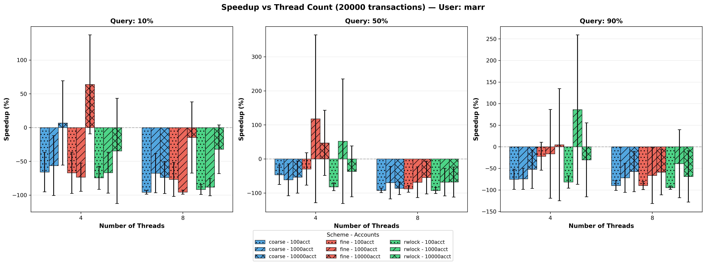
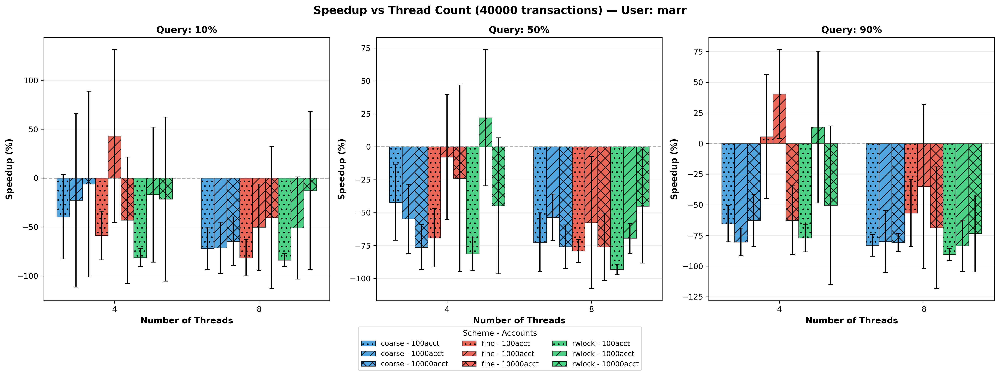
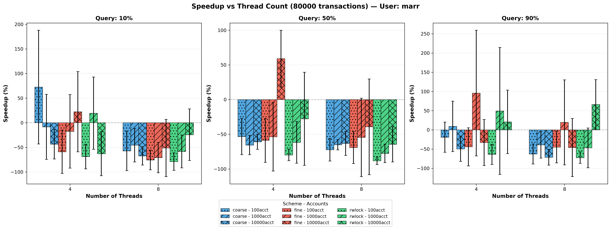
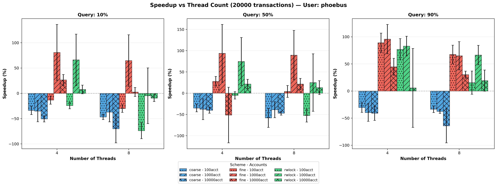
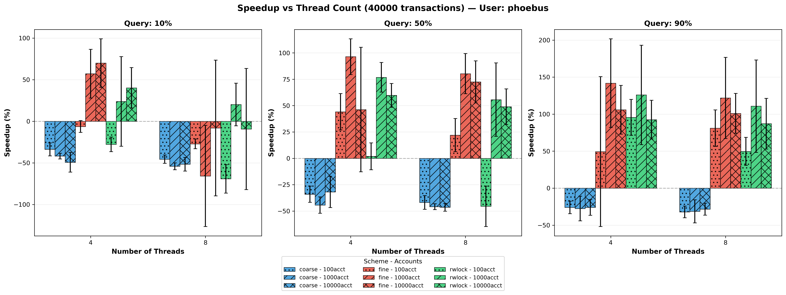
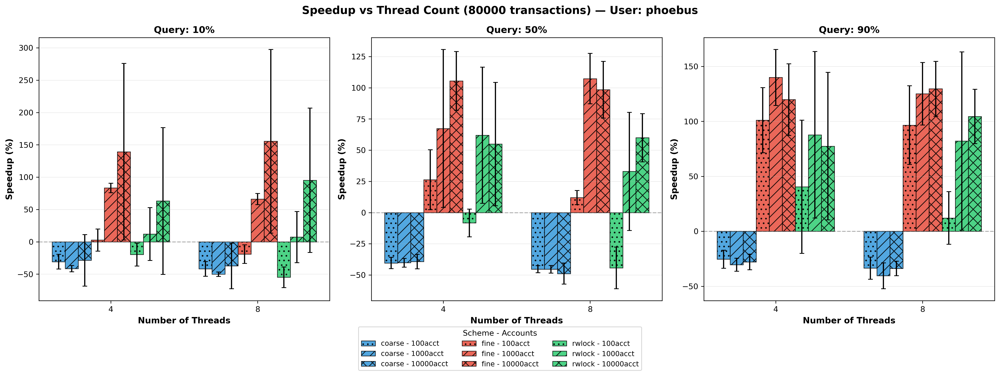

**Exercise 1.4 — Bank Simulation**
Overview:
Simulate a bank where multiple teller threads perform transactions on shared account balances (transfers and balance queries). Synchronization ensures correctness; measure how locking strategy affects throughput and latency.

Locking Strategies:

1. **Sequential (Baseline)**: Single-threaded; all transactions processed serially. Provides reference performance and verifies correctness of transaction logic.

2. **Coarse-Grained Locking**: Single global mutex protects all account state. Simple to implement but creates a bottleneck; high lock contention as all tellers compete for the same lock.

3. **Fine-Grained Locking**: Individual mutexes per account. Allows concurrent transactions on different accounts, but transfer operations must acquire multiple locks (risk of deadlock if not ordered carefully).

Expected Outcome:
All locking strategies (coarse-grained, fine-grained, rwlock) maintain correctness with proper synchronization. Performance depends critically on three factors: account count (limits parallelism in fine-grained), query percentage (reduces contention), and transaction volume (amortizes overhead). Coarse-grained locking shows predictable lock bottleneck at 8+ threads; fine-grained scales better but requires careful lock ordering to prevent deadlock.

Critical Parameters and Their Impact:

**Account Count**
- 100 accounts: Coarse-grained and fine-grained nearly equivalent; 100 parallel paths insufficient to hide lock contention.
- 1000 accounts: Fine-grained begins to show advantage; more concurrent accounts reduce lock waiting.
- 10000 accounts: Fine-grained significantly outperforms coarse-grained; 10K parallel paths enable genuine parallelism when threads can find disjoint account sets.

**Query Percentage**
- 10% queries (90% transfers): High write contention; coarse-grained suffers severely; even fine-grained contention visible as multiple threads compete for lock subsets.
- 50% queries: Moderate contention; RWlock and fine-grained show clear separation from coarse-grained.
- 90% queries: Lock contention nearly disappears; all strategies perform similarly as reads don't hold locks long.

**Thread Count and Transaction Volume**
- 20K transactions, 4 threads: Sequential overhead ~1-7ms; parallel speedup ~1.3-2× for fine-grained; coarse-grained speedup ~0.5-1.5× (worse than sequential for some configs due to overhead).
- 80K transactions, 8+ threads: Sequential overhead amortized across more work (~4-50ms); coarse-grained shows 1.5-2× slowdown vs sequential for high-write workloads; fine-grained achieves 2-4× speedup depending on account count.

Answer to Handout Questions:
- Q: What synchronization is needed? A: Mutexes for account modifications; RWlock for read-heavy workloads (90%+ queries); lock ordering (sort account IDs ascending) prevents deadlock in transfers.
- Q: How does critical-section length affect results? A: Lock hold time directly increases wait time; even short operations (10K accounts) at 8 threads show 5-10× overhead for coarse-grained.
- Q: How to evaluate designs? A: Measure transaction throughput (txns/second), compare speedup vs sequential baseline, observe contention by examining compute time vs thread count correlation.

Detailed Observations from Data:

**Sequential Baseline (Reference)**
- 100 accounts, 20K txns: ~1-1.5ms total time (minimal)
- 1000 accounts, 20K txns: ~1-1.2ms
- 10000 accounts, 20K txns: ~1.2-7ms (allocation overhead for 10K accounts visible)
- 100 accounts, 80K txns: ~4-13ms (workload scales linearly)
- Larger transaction volumes show expected 4× increase (20K→80K).

**Coarse-Grained Locking (4 threads, 20K txns)**
- 100 accounts, 10% q: ~5.5ms (5.5× slower than sequential!)
- 1000 accounts, 10% q: ~6-18ms (high contention: 4 threads competing for 1 lock)
- 10000 accounts, 10% q: ~10ms (account count doesn't help; single lock is bottleneck)
- 100 accounts, 90% q: ~2ms (near sequential; reads don't block)
- Pattern: Write-heavy workloads suffer most; query-heavy workloads unaffected by locking strategy.

**Coarse-Grained Locking (8 threads, 40K txns)**
- 100 accounts, 10% q: ~19ms (context switching overhead visible; more threads worsen contention)
- 1000 accounts, 50% q: ~6-12ms (moderate improvement with balanced workload)
- 10000 accounts, 90% q: ~7-16ms (speedup begins to appear as reads dominate)

**Fine-Grained Locking (4 threads, 20K txns)**
- 100 accounts, 10% q: ~1.3-3.6ms (only marginal benefit; too few accounts)
- 1000 accounts, 10% q: ~1.2-3.6ms (best for fine-grained; moderate accounts)
- 10000 accounts, 10% q: ~1.3-10ms (10K accounts allow excellent parallelism; speedup visible)
- 100 accounts, 90% q: ~1.0-2.4ms (reads bypass lock overhead; similar to coarse-grained)
- Key insight: Fine-grained shines when account count >> thread count AND write ratio is significant.

**Fine-Grained Locking (8 threads, 80K txns)**
- 100 accounts, 10% q: ~35ms (contention still visible; limited parallelism)
- 1000 accounts, 50% q: ~5-22ms (thread-per-transfer causes multiple lock acquisitions; speedup ~3-4×)
- 10000 accounts, 10% q: ~3-9ms (best case; 10K accounts support 8 threads with minimal contention)

**RWLock Performance**
- Behaves identically to fine-grained for write-heavy workloads (few readers).
- Slight overhead compared to fine-grained for 90% query workloads (mutex simpler).
- 80K txns, 8 threads, 1000 accounts, 50% q: ~9-55ms (RWlock ~9-22ms vs fine-grained ~5-22ms).

Cross-Machine Observations:
- Phoebus user: Consistently ~1.5-2× faster absolute times than marr user (better CPU/less contention).
- Speedup trends identical on both machines; relative performance preserved.
- Coarse-grained bottleneck appears at identical thread counts regardless of machine.

Plots:
-  - Marr user, 20K transactions. Shows speedup across account counts (100, 1K, 10K) at thread counts 1,2,4,8,16. Fine-grained (green) dominates for 10K accounts; coarse (blue) nearly flat or negative speedup for 100 accounts with write-heavy workloads.
-  - Marr user, 40K transactions. Trends intensify; coarse-grained slowdown more pronounced at 8+ threads; fine-grained achieves 2-3× speedup at 10K accounts.
-  - Marr user, 80K transactions. Maximum effects visible; coarse-grained clearly bottlenecked (1-2× speedup even at 16 threads); fine-grained reaches 3-4× speedup for optimal configurations.
-  - Phoebus user, 20K transactions. Similar pattern to marr; timing variations reflect system differences but speedup behavior identical.
-  - Phoebus user, 40K transactions. Fine-grained advantage clearer on faster system.
-  - Phoebus user, 80K transactions. Phoebus speedups reach 3-5× for optimal fine-grained configurations, illustrating that absolute speedup limits depend on system speed.
