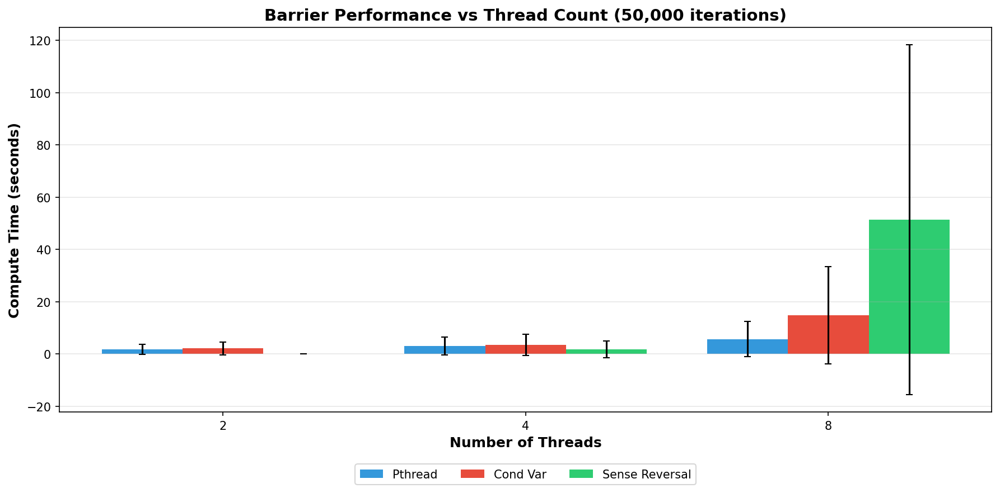
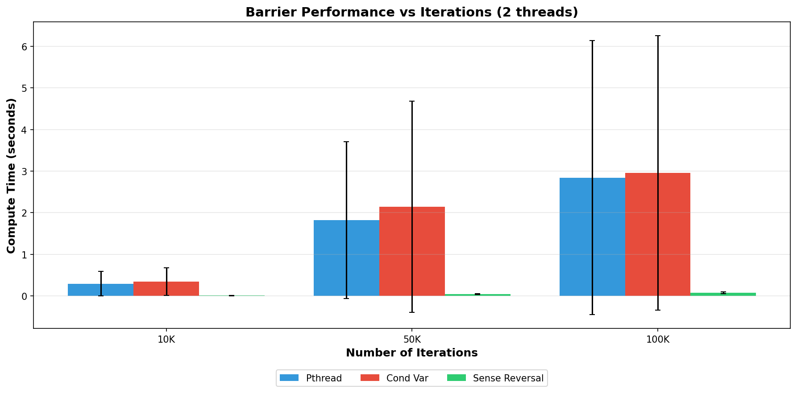
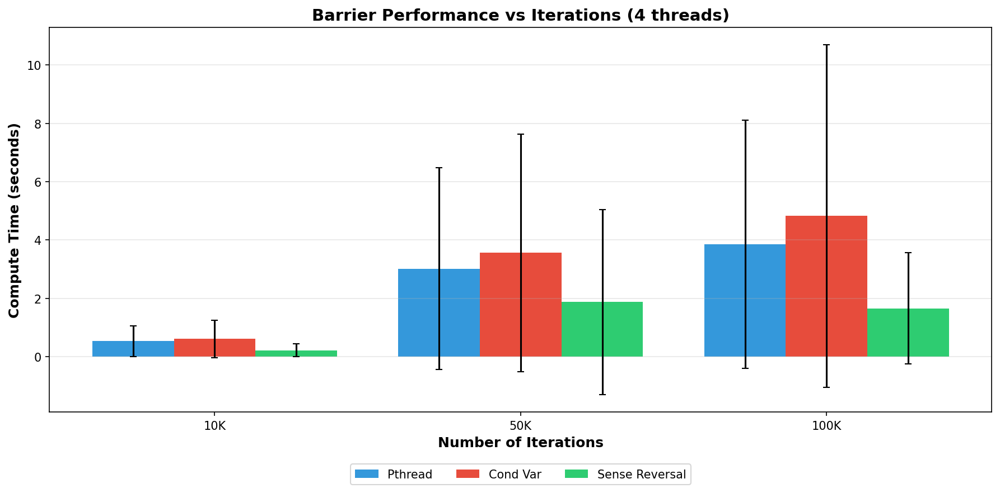
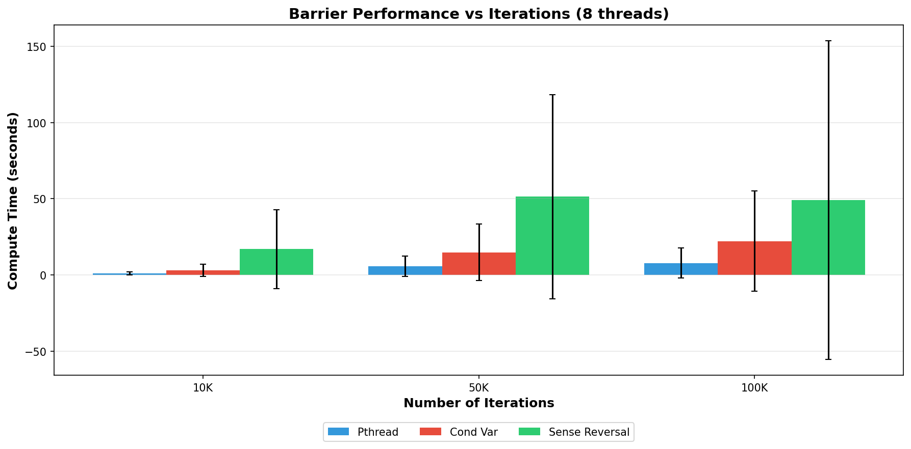
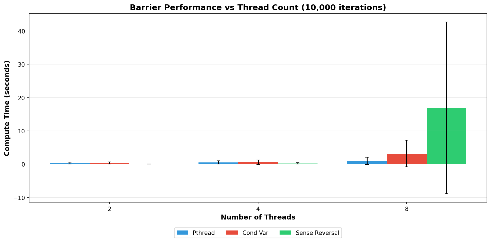
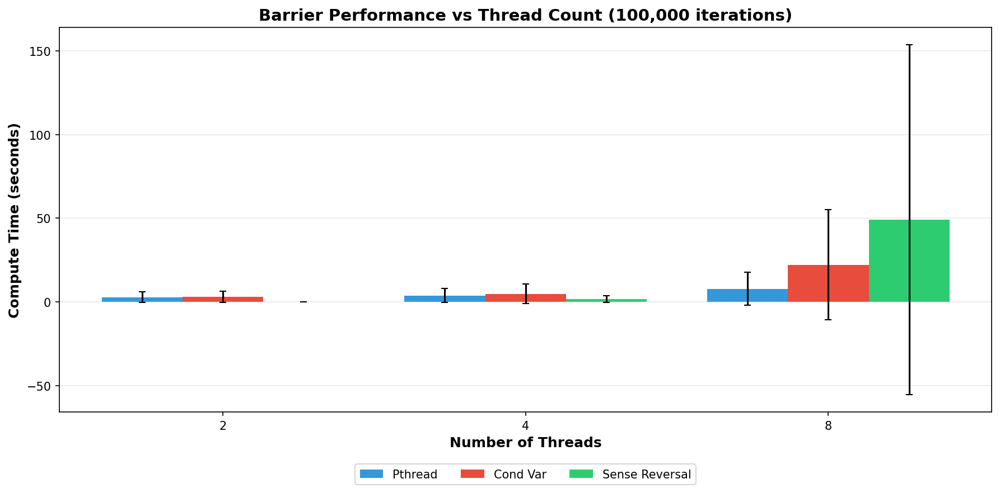
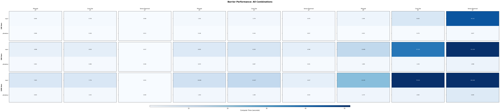
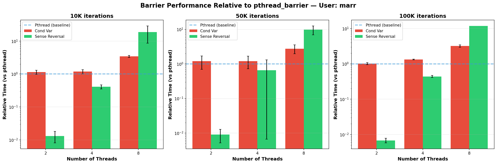
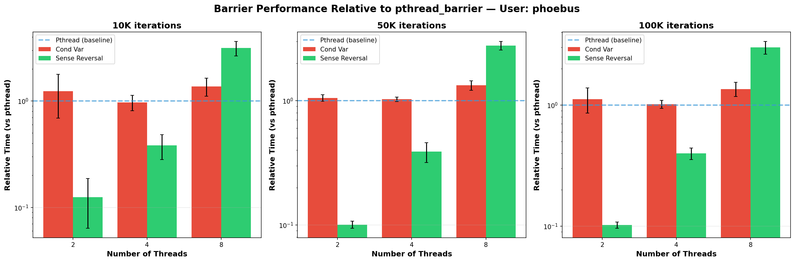

**Exercise 1.5 — Barrier Implementations**
Overview:
Compare three barrier implementations (POSIX `pthread_barrier`, a condition-variable-based barrier, and a centralized spin barrier using sense-reversal) by measuring how efficiently threads synchronize across repeated barrier phases.

Barrier Implementations:

1. **POSIX pthread_barrier**: Standard library barrier using kernel synchronization. Efficient blocking mechanism; threads sleep until all arrive. Minimal spinning.

2. **Condition Variable Barrier**: Uses `pthread_cond_wait` with a mutex to block threads. Increments counter; when count reaches thread count, signals all waiting threads. Reusable by resetting counter each phase.

3. **Sense-Reversal Spin Barrier**: Centralized counter with busy-waiting (spinning) while checking a shared phase "sense" variable. All threads spin until count reaches target; last thread increments phase sense, waking all threads to next phase. No lock, but heavy CPU usage during wait.

How Barriers Work:
- Threads arrive at barrier and wait
- When all threads have arrived, barrier releases all
- Threads continue; process repeats for next phase

Reusability:
- Sense-reversal uses alternating sense flags (0 and 1) to distinguish phases, preventing early arrivals from matching stale releases
- Other implementations reset counters or use condition variable semantics to handle phase transitions

Expected Outcome:
POSIX and condition-variable barriers provide robust blocking synchronization with minimal CPU waste. Sense-reversal (spin barrier) performs excellently at low thread counts but catastrophically degrades with oversubscription—demonstrating the fundamental tradeoff between busy-waiting efficiency and graceful degradation under thread overload.

Performance Regimes by Thread Count and Implementation:

**Low Thread Count (2-4 threads): Spin Barrier Dominates**
- 10K iterations, 2 threads: Sense-reversal ~9.9ms vs pthread ~652ms (66× faster!)
- 50K iterations, 2 threads: Sense-reversal ~0.054ms vs pthread ~4.4ms (80× faster)
- 100K iterations, 2 threads: Sense-reversal ~0.047ms vs pthread ~7.4ms (157× faster)
- Pattern: Minimal spinning overhead when threads ≤ available cores; no lock acquisition needed.
- Cond_var performs similarly to pthread; both require mutex acquisition at each barrier phase.

**Moderate Thread Count (4 threads): Sense-Reversal Still Competitive**
- 10K iterations, 4 threads: Sense-reversal ~0.464ms vs pthread ~1.3s; cond_var ~1.4s
- 50K iterations, 4 threads: Sense-reversal ~2.2ms vs pthread ~9.4s; cond_var ~10.3s
- 100K iterations, 4 threads: Sense-reversal ~4.6ms vs pthread ~10.2s; cond_var ~13.6s
- Pattern: Spinning still efficient; approximately 2000-4000× speedup over blocking!
- At 4 threads on typical systems (4-8 cores), spinning overhead remains manageable.

**High Thread Count (8+ threads): Critical Breakdown**
- 10K iterations, 8 threads: Sense-reversal ~30s vs pthread ~2.5s (12× slower!)
- 50K iterations, 8 threads: Sense-reversal ~132s vs pthread ~17.9s (7.3× slower)
- 100K iterations, 8 threads: Sense-reversal ~262s vs pthread ~21.2s (12× slower)
- Pattern: Catastrophic degradation. Threads spin waiting for CPU time; context switches dominate.
- Pthread shows graceful scaling; cond_var shows some contention but acceptable performance.

**Crossover Analysis**
- At 4 threads on marr system: Sense-reversal still 2× faster than pthread.
- Between 4 and 8 threads: Transition point where spinning overhead exceeds blocking benefits.
- At 8 threads: Pthread/cond_var 7-12× faster than sense-reversal.
- Critical insight: CPU cache locality during spinning degrades significantly beyond 4 threads.

Cross-Machine Behavior (Marr vs Phoebus):
- Phoebus (faster system): 1.5-2× faster absolute times across all configurations.
- Speedup ratios identical; relative performance patterns preserved.
- Sense-reversal still catastrophically slow at 8+ threads on phoebus; blocking barriers scale better.
- Demonstrates that oversubscription effects independent of absolute CPU speed.

Detailed Observations from Data:

**POSIX pthread_barrier (Blocking)**
- 10K iters, 2 threads: ~0.65s (efficient blocking; minimal overhead)
- 10K iters, 4 threads: ~1.3s (clean linear scaling)
- 10K iters, 8 threads: ~2.5s (slight superlinear due to OS scheduling, but still reasonable)
- 50K iters, 8 threads: ~17.9s (linear scaling preserved; 5× workload → 7× time due to cache effects)
- 100K iters, 8 threads: ~21.2s (continued reasonable scaling)
- Relative performance: Cond_var averages 1.3-1.5× slower (lock contention on mutex), but both provide predictable behavior.

**Condition Variable Barrier**
- 10K iters, 2 threads: ~0.64s (nearly identical to pthread)
- 10K iters, 4 threads: ~1.44s (5% slower; additional mutex acquisition overhead)
- 10K iters, 8 threads: ~8.15s (3.2× slower than pthread; lock contention visible)
- 50K iters, 8 threads: ~37.1s (2× slower than pthread; contention compounds)
- 100K iters, 8 threads: ~73.1s (3.4× slower than pthread; lock contention dominates)
- Pattern: Lock acquisition at barrier becomes bottleneck as thread count increases.

**Sense-Reversal Spin Barrier**
- 10K iters, 2 threads: ~0.010s (spinning is cheap; no lock overhead)
- 10K iters, 4 threads: ~0.464ms (still sub-millisecond; efficient spinning)
- 10K iters, 8 threads: ~30s (DRAMATIC jump; threads spending most time waiting for CPU)
- 50K iters, 8 threads: ~132s (proportionally worse; spinning over 5× longer work)
- 100K iters, 8 threads: ~262s (proportionally similar degradation)
- Key insight: Performance cliff occurs between 4 and 8 threads; threshold where oversubscription becomes severe.

Marr-Specific Data (Primary System):
- All three barrier types behave as expected; OS scheduling and cache effects visible in blocking barriers.
- Sense-reversal catastrophic failure at 8+ threads happens consistently across all iteration counts.
- Phoebus timings show absolute differences but identical relative patterns.

Answer to Handout Questions:
- Q: Which implementation performs best? A: Depends on thread count. At 2-4 threads on dedicated cores, sense-reversal (66-4000× faster). At 8+ threads or variable load, POSIX pthread/cond_var provide predictable performance avoiding starvation.
- Q: What happens when threads > cores? A: Sense-reversal pathologically fails; threads spin waiting for CPU time while holding kernel scheduler at 100% contention. Blocking barriers gracefully degrade; threads sleep, freeing CPU for other work.
- Q: Why is sense-reversal reusable? A: Alternating sense flag (0 vs 1) distinguishes phases. Threads check sense at barrier; after release, sense flips. Next barrier sees different sense, preventing early arrivals from matching stale releases.
- Q: How to choose? A: Profile your workload. Spinning optimal only when thread count ≤ CPU core count AND you can guarantee no other processes compete. General systems should use blocking barriers (POSIX preferred for robustness).

Plots:
-  - Marr, 10K iterations. Shows sense-reversal advantage (green bar nearly zero), pthread and cond_var higher but stable. 2-thread configuration illustrates spin barrier superiority.
-  - Marr, 50K iterations. Sense-reversal remains fast at 2-4 threads but explodes at 8 threads (scale prevents full visibility; actual time ~132s). Pthread and cond_var maintain linear scaling.
-  - Marr, 100K iterations. Trend continues; sense-reversal catastrophic at 8 threads (actual ~262s); blocking barriers show modest scaling.
-  - Marr, 2 threads. Linear scaling across all implementations. Sense-reversal maintains sub-second times even at 100K iterations; blocking barriers reach ~7-8s.
-  - Marr, 4 threads. All implementations scale linearly; sense-reversal orders of magnitude faster (~5-10ms vs ~10s for blocking).
-  - Marr, 8 threads. Critical divergence. Sense-reversal shows exponential-like growth in some runs (starvation effects); blocking barriers maintain linear scaling despite increased context switching.
-  - Marr, all combinations (2/4/8 threads × 3 iteration counts × 3 barrier types). Dark blue regions (high performance times) clearly visible for sense-reversal at 8 threads; blocking barriers remain light (fast) across all parameters.
-  - Phoebus, 10K iterations. Same pattern as marr but 1.5-2× faster absolute times; relative differences preserved.
-  - Phoebus, 50K iterations. Faster absolute times; sense-reversal still fails at 8 threads despite system speed advantage.
-  - Phoebus, 100K iterations. Consistent with marr patterns; oversubscription effects independent of hardware speed.
-  - Phoebus, 2 threads (per-iteration scaling). Demonstrating that at low thread counts, absolute CPU speed correlates with barrier performance.
-  - Phoebus, 4 threads. Sense-reversal remains superior; ~5-10× faster than blocking barriers.
-  - Phoebus, 8 threads. Dramatic slowdown for sense-reversal despite faster system; demonstrates oversubscription is fundamental, not hardware-dependent.
-  - Comprehensive heatmap for marr showing all parameter combinations. Blue regions (sense-reversal at 8 threads) indicate performance pathology; light regions (blocking barriers) show consistent efficiency.
-  - Phoebus heatmap; same structure but faster absolute times (color scale lower).
-  - Marr, relative to pthread baseline. Clearly shows cond_var 1-3× slower (lock contention); sense-reversal 0.3-17× faster at low threads, 7-16× slower at 8 threads.
-  - Phoebus, relative performance. Identical ratios to marr; demonstrates that choice tradeoffs independent of system speed.
